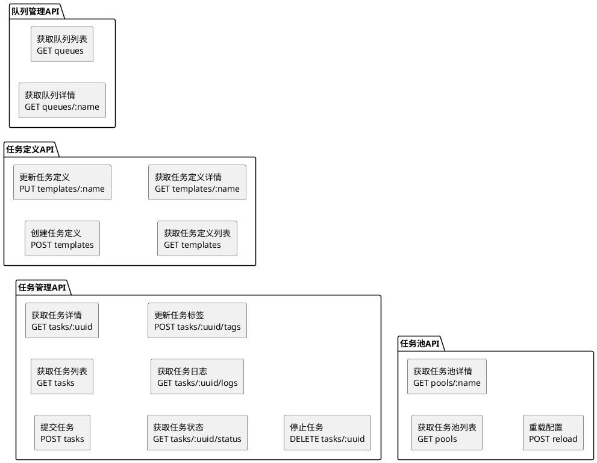

# API文档

## 接口概览



## 详细接口说明

### 1. 任务管理接口

```go

type TaskObj struct {
  ID         int        `gorm:"primary_key;auto_increment;comment:Primary Key" json:"-"`
  UUID       string     `gorm:"column:uuid;type:varchar(255);comment:任务UUID" json:"uuid,omitempty"`
  Template    string     `gorm:"column:template;type:varchar(255);comment:任务模板名" json:"template,omitempty"`
  Namespace  string     `gorm:"column:namespace;type:varchar(255);comment:数据空间名" json:"namespace,omitempty"`
  Name       string     `gorm:"column:name;type:varchar(255);comment:任务名" json:"name,omitempty"`
  Project    string     `gorm:"column:project;type:varchar(255);comment:项目名" json:"project,omitempty"`
  Extra      string     `gorm:"column:extra;type:text;comment:该任务模板的额外信息" json:"extra,omitempty"`
  Args      string     `gorm:"column:args;type:text;comment:该任务的参数" json:"args,omitempty"`
  Timeout    string     `gorm:"column:timeout;type:varchar(255);comment:各阶段超时时间" json:"timeout,omitempty"`
  Quotas     string     `gorm:"column:quotas;type:text;comment:资源配额" json:"quotas,omitempty"`
  Pool       string     `gorm:"column:pool;type:varchar(255);comment:排队的任务池" json:"pool,omitempty"`
  Tags       string     `gorm:"column:tags;type:text;comment:标记,可影响调度,格式:[key=value]" json:"tags,omitempty"`
  Callback   string     `gorm:"column:callback;type:varchar(512);comment:回调URL" json:"callback,omitempty"`
  Status     string     `gorm:"column:status;type:varchar(25);comment:任务状态" json:"status,omitempty"`
  CreatedBy  string     `gorm:"column:created_by;type:varchar(255);comment:创建者" json:"created_by,omitempty"`
  CreateTime *time.Time `gorm:"column:create_time;type:datetime;comment:创建时间" json:"create_time,omitempty"`
  StartTime  *time.Time `gorm:"colomn:start_time;type:datetime;comment:启动时间" json:"start_time,omitempty"`
  EndTime    *time.Time `gorm:"colomn:end_time;type:datetime;comment:结束时间" json:"end_time,omitempty"`
  UpdateTime *time.Time `gorm:"column:update_time;type:datetime;comment:更新时间" json:"update_time,omitempty"`
}
```

发送给回调的消息体：

```go
type TaskFinishedCallback struct {
  Name    string `json:"name"`
  Uuid    string `json:"uuid"`
  RunId   string `json:"runid"`
  Status  string `json:"status"`
  Message string `json:"message"`
}
```

#### 1.1 任务提交

- **URL**: `/v2/tasks`
- **Method**: POST
- **描述**: 提交一个新任务
- **请求体**:

```json
{
  "uuid": "3a1e5f8b-2c4d-49f1-a68c-1b3d5e7f2a9g",
  "template": "codereview",      // 任务模板名称
  "namespace": "username",      //  任务命名空间，可以是提交用户名
  "name": "mnist-training-20250528", //任务名，可以为空
  "project": "ai-models",       // 用户所在组织的名字，可以为空
  "extra": "{\"epochs\": 100, \"batch_size\": 32}",  //任务模板的extra参数，可以覆盖任务模板原始的extra参数
  "value": "{\"datasets\": [\"mnist\"], \"model\": \"resnet50\"}", //任务参数变量
  "prior": 5, // 任务优先级
  "timeout": "7200", //超时
  "quotas": "{\"cpu\": 4, \"gpu\": 2, \"memory\": \"16Gi\"}", //资源限额
  "pool": "gpu-pool-1", //任务池
  "adjustable": true,
  "tags": "project=ai-models,type=training",
  "callback": "https://api.example.com/callbacks/training",
  "schedule": "0 0 * * *",
  "times": 1
}

```

- **响应**:

```json
{
  "code": "0",
  "message": "OK",
  "success": true,
  "data": {
    "uuid": "string",       // 任务UUID
    "run_id": "string"      // 运行ID
  }
}
```

#### 1.3 获取任务列表

- **URL**: `/v2/tasks`
- **Method**: GET
- **描述**: 获取任务列表
- **查询参数**:
  - status: 任务状态
  - page: 页码
  - size: 每页大小
- **响应**:

```json
{
  "code": "0",
  "message": "OK",
  "success": true,
  "data": {
    "total": 0,
    "tasks": []             // 任务列表
  }
}
```

#### 1.4 获取任务详情

- **URL**: `/v2/tasks/{uuid}`
- **Method**: GET
- **描述**: 获取任务的详细信息
- **响应**:

```json
{
  "code": "0",
  "message": "OK",
  "success": true,
  "data": {
    // 任务详情数据结构
  }
}
```

#### 1.5 获取任务状态

- **URL**: `/v2/tasks/{uuid}/status`
- **Method**: GET
- **描述**: 获取任务的当前状态
- **响应**:

```json
{
  "code": "0",
  "message": "OK",
  "success": true,
  "data": {
    "status": "string"      // 任务状态
  }
}
```

#### 1.6 获取任务日志

- **URL**: `/v2/tasks/{uuid}/logs`
- **Method**: GET
- **描述**: 获取任务的执行日志
- **响应**: 返回日志文本流

#### 1.7 停止任务

- **URL**: `/v2/tasks/{uuid}`
- **Method**: DELETE
- **描述**: 停止指定任务
- **响应**:

```json
{
  "code": "0",
  "message": "OK",
  "success": true,
  "data": null
}
```

### 2. 实例管理接口

#### 2.1 获取实例列表

- **URL**: `/v2/instances`
- **Method**: GET
- **描述**: 获取任务实例列表
- **查询参数**:
  - task_id: 关联的任务ID
  - status: 实例状态
- **响应**:

```json
{
  "code": "0",
  "message": "OK",
  "success": true,
  "data": {
    "total": 0,
    "instances": []         // 实例列表
  }
}
```

#### 2.2 获取实例详情

- **URL**: `/v2/instances/{runid}`
- **Method**: GET
- **描述**: 获取任务实例的详细信息
- **响应**:

```json
{
  "code": "0",
  "message": "OK",
  "success": true,
  "data": {
    // 实例详情数据结构
  }
}
```

#### 2.3 获取实例状态

- **URL**: `/v2/instances/{runid}/status`
- **Method**: GET
- **描述**: 获取任务实例的当前状态
- **响应**:

```json
{
  "code": "0",
  "message": "OK",
  "success": true,
  "data": {
    "status": "string"      // 实例状态
  }
}
```

#### 2.4 获取实例日志

- **URL**: `/v2/instances/{runid}/logs`
- **Method**: GET
- **描述**: 获取任务实例的执行日志
- **响应**: 返回日志文本流

#### 2.5 更新实例标签

- **URL**: `/v2/instances/{runid}/tags`
- **Method**: POST
- **描述**: 更新任务实例的标签
- **请求体**:

```json
{
  "tags": ["tag1", "tag2"]
}
```

- **响应**:

```json
{
  "code": "0",
  "message": "OK",
  "success": true,
  "data": null
}
```

### 3. 任务定义接口

```go

type TaskDef struct {
  ID         int       `gorm:"column:id;primary_key;auto_increment;comment:Primary Key" json:"id,omitempty"`
  Name       string    `gorm:"column:name;type:varchar(255);unique;comment:任务模板名称" json:"name,omitempty"`
  Title      string    `gorm:"column:title;type:varchar(255);comment:任务模板标题" json:"title,omitempty"`
  Schema     string    `gorm:"column:schema;type:text;comment:Pod执行模板" json:"schema,omitempty"`
  Engine       string    `gorm:"column:type;type:varchar(255);comment:任务模板" json:"type,omitempty"`
  Extra      string    `gorm:"column:extra;type:text;comment:任务模板的扩展参数集" json:"extra,omitempty"`
  CreateTime time.Time `gorm:"column:create_time;autoCreateTime;comment:Create Time" json:"create_time,omitempty"`
}

```

#### 3.1 获取任务定义列表

- **URL**: `/v2/templates`
- **Method**: GET
- **描述**: 获取所有任务模板列表
- **响应**:

```json
{
  "code": "0",
  "message": "OK",
  "success": true,
  "data": ["type1", "type2"]  // 任务模板列表
}
```

#### 3.2 获取任务定义详情

- **URL**: `/v2/templates/{name}`
- **Method**: GET
- **描述**: 获取指定任务模板的定义详情
- **响应**:

```json
{
  "code": "0",
  "message": "OK",
  "success": true,
  "data": {
    // 任务定义详情
  }
}
```

#### 3.3 创建任务定义

- **URL**: `/v2/templates`
- **Method**: POST
- **描述**: 创建一个新的任务模板
- **请求体**:

```json
{
  "name": "train-job",      // 任务模板名称
  "title": "Training Job",  // 任务模板标题
  "schema": "go template", //任务模板，采用GO模板语法，可以根据任务定义extra，任务参数动态生成
  "type": "pod",            //目前支持pod, kfjob, deployment, crd, agent, prompt这几种类型
  "extra": "{"gpu": 1, "memory": "8Gi"}",
  "create_time": "2025-05-28T08:54:11+08:00"
}
```

- **响应**:

```json
{
  "code": "0",
  "message": "OK",
  "success": true,
  "data": {
    "id": 1,            // 定义ID
    "name": "string"    // 任务模板名称
  }
}
```

#### 3.4 更新任务定义

- **URL**: `/v2/templates/{name}`
- **Method**: PUT
- **描述**: 更新指定任务模板的定义
- **请求体**: 同创建接口
- **响应**:

```json
{
  "code": "0",
  "message": "OK",
  "success": true,
  "data": {
    "id": 1,            // 定义ID
    "name": "string"    // 任务模板名称
  }
}
```

### 4. 队列管理接口

#### 4.1 获取队列列表

- **URL**: `/v2/queues`
- **Method**: GET
- **描述**: 获取所有任务队列信息
- **响应**:

```json
{
  "code": "0",
  "message": "OK",
  "success": true,
  "data": [
    {
      "name": "string",     // 队列名称
      "size": 0,            // 队列大小
      "waiting": 0          // 等待中的任务数
    }
  ]
}
```

#### 4.2 获取队列详情

- **URL**: `/v2/queues/{name}`
- **Method**: GET
- **描述**: 获取指定队列的详细信息
- **查询参数**:
  - verbose: 是否返回详情(true/false)
- **响应**:

```json
{
  "code": "0",
  "message": "OK",
  "success": true,
  "data": {
    // 队列详情数据结构
  }
}
```

### 5. 任务池管理接口

#### 5.1 获取任务池列表

- **URL**: `/v2/pools`
- **Method**: GET
- **描述**: 获取所有任务池信息
- **响应**:

```json
{
  "code": "0",
  "message": "OK",
  "success": true,
  "data": [
    {
      "name": "string",     // 任务池名称
      "usage": 0.5,         // 资源使用率
      "tasks": 10           // 运行中的任务数
    }
  ]
}
```

#### 5.2 获取任务池详情

- **URL**: `/v2/pools/{name}`
- **Method**: GET
- **描述**: 获取指定任务池的详细信息
- **查询参数**:
  - verbose: 是否返回详情(true/false)
- **响应**:

```json
{
  "code": "0",
  "message": "OK",
  "success": true,
  "data": {
    // 任务池详情数据结构
  }
}
```

#### 5.3 获取SLA列表

- **URL**: `/v2/slas`
- **Method**: GET
- **描述**: 获取任务池的SLA保障规则
- **响应**:

```json
{
  "code": "0",
  "message": "OK",
  "success": true,
  "data": [
    // SLA规则列表
  ]
}
```

#### 5.4 获取策略列表

- **URL**: `/v2/policys`
- **Method**: GET
- **描述**: 获取任务池的任务筛选策略
- **响应**:

```json
{
  "code": "0",
  "message": "OK",
  "success": true,
  "data": [
    // 策略列表
  ]
}
```

#### 5.5 重载配置

- **URL**: `/v2/reload`
- **Method**: POST
- **描述**: 重新加载任务池配置
- **响应**:

```json
{
  "code": "0",
  "message": "OK",
  "success": true,
  "data": "reload OK"
}
```

### 5. 任务池接口

#### 5.1 获取任务池列表

- **URL**: `/v2/pools`
- **Method**: GET
- **描述**: 获取所有任务池信息
- **响应**:

```json
{
    "code": 0,
    "message": "success",
    "data": {
        "pools": []
    }
}
```

## 错误码说明

| 错误码 | 描述 |
|--------|------|
| 0 | 成功 |
| 1001 | 参数错误 |
| 1002 | 任务不存在 |
| 1003 | 实例不存在 |
| 1004 | 队列不存在 |
| 1005 | 资源不足 |
| 2001 | 系统错误 |
| 2002 | 数据库错误 |
| 2003 | K8S操作错误 |

## 接口调用示例

### 提交任务

```bash
curl -X POST http://localhost:8080/v2/tasks \
  -H "Content-Type: application/json" \
  -d '{
    "task_type": "pod",
    "parameters": {
      "image": "nginx:latest",
      "command": ["echo", "hello"]
    }
  }'
```

### 获取任务状态

```bash
curl -X GET http://localhost:8080/v2/tasks/123/status
```

### 6. 系统状态接口

#### 6.1 获取系统状态

- **URL**: `/v2/status`
- **Method**: GET
- **描述**: 获取系统整体运行状态和健康检查信息
- **响应**:

```json
{
  "code": "0",
  "message": "OK",
  "success": true,
  "data": {
    "status": "healthy",    // 系统状态
    "components": [         // 组件状态
      {
        "name": "db",
        "status": "ok"
      }
    ]
  }
}
```

## 注意事项

1. 所有接口都需要认证
2. 请求频率限制：100次/分钟
3. 响应时间：< 1秒
4. 支持HTTPS
5. 支持压缩传输
6. 接口前缀说明：
   - API接口统一使用`/v2/`前缀
