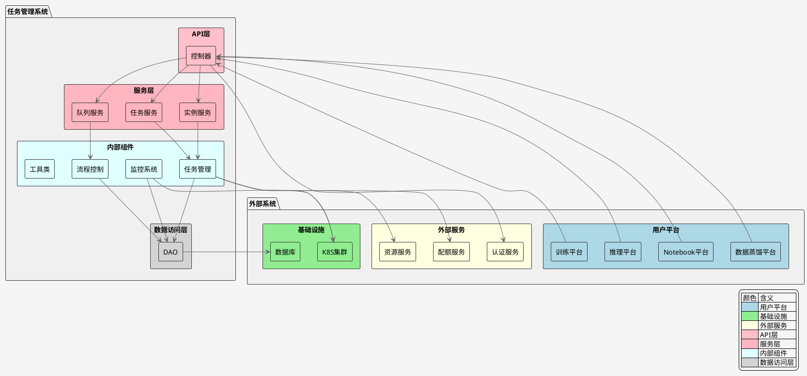
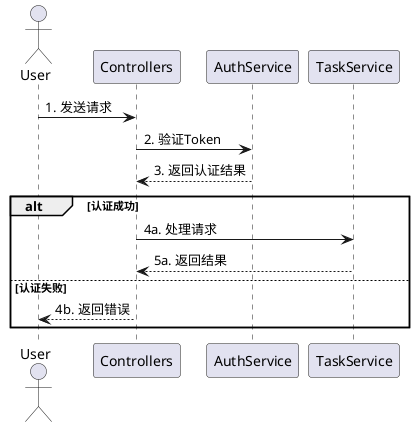
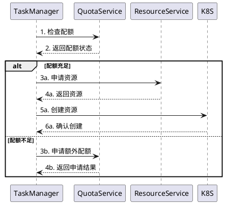
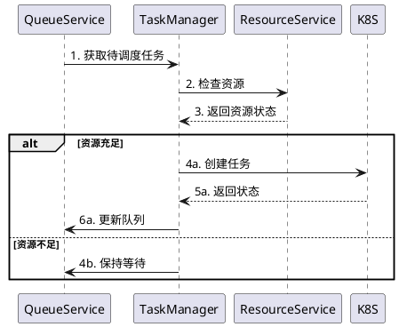
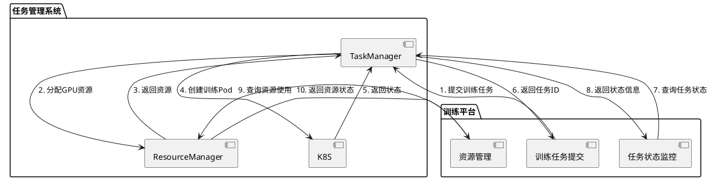
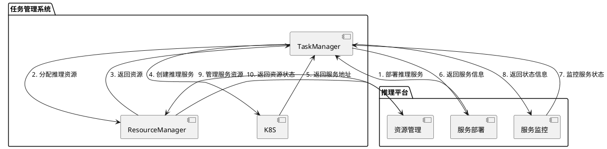
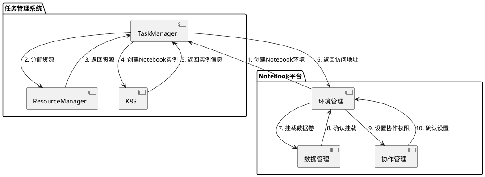
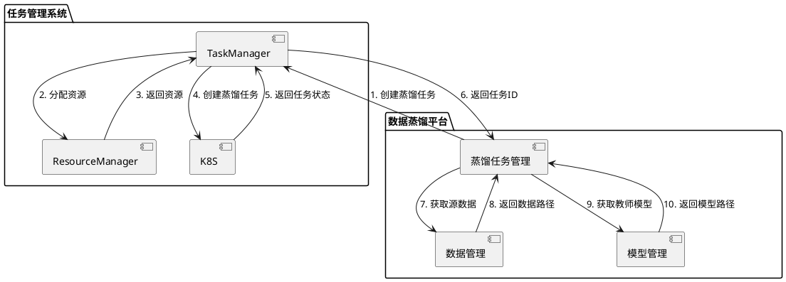

# 系统架构文档

## 系统架构图

## 系统组件说明

### 1. 外部系统
#### 1.1 用户平台
- **训练平台**：用于提交和管理训练任务
- **推理平台**：用于部署和管理推理服务
- **Notebook平台**：用于创建和管理开发环境
- **数据蒸馏平台**：用于执行和管理蒸馏任务

#### 1.2 基础设施
- **K8S集群**：提供计算资源，运行各类任务
- **数据库**：存储系统数据，包括任务信息、用户信息等

#### 1.3 外部服务
- **配额服务**：管理用户和项目的资源配额
- **资源服务**：管理集群资源池，提供资源分配和释放
- **认证服务**：处理用户认证和权限管理

### 2. API层（Controllers）
- 处理所有HTTP请求
- 实现RESTful API接口
- 请求参数验证
- 响应数据格式化
- 与认证服务集成

### 3. 服务层（Service）
- 实现业务逻辑
- 任务生命周期管理
- 实例状态管理
- 队列调度管理
- 与配额服务集成

### 4. 内部组件（Internal）
#### 4.1 任务管理（TaskManager）
- 任务引擎注册
- 任务创建和销毁
- 任务状态转换
- 超时处理
- 与资源服务集成

#### 4.2 流程控制（FlowControl）
- 任务队列管理
- 周期性任务处理
- 任务状态监控
- 资源调度
- 与K8S集群交互

#### 4.3 监控系统（Monitor）
- 资源使用监控
- 性能指标收集
- 告警处理
- 白名单管理
- 与K8S集群集成

#### 4.4 工具类（Utils）
- 配置管理
- 日志处理
- 认证授权
- K8S操作
- 通用工具函数

### 5. 数据访问层（DAO）
- 数据库操作封装
- 数据模型定义
- 事务管理
- 缓存处理
- 数据持久化

## 系统交互流程

### 1. 用户认证流程

### 2. 资源分配流程

### 3. 任务调度流程

## 平台集成说明

### 1. 训练平台集成
训练平台使用任务管理系统主要实现训练任务的提交和管理，具体包括：
- 提交训练任务到任务队列
- 管理训练任务的资源分配
- 监控训练任务的执行状态
- 获取训练任务的日志和结果
- 管理训练任务的优先级和调度

### 2. 推理平台集成
推理平台使用任务管理系统主要实现推理服务的部署和管理，具体包括：
- 部署推理服务到K8S集群
- 管理推理服务的资源分配
- 监控推理服务的运行状态
- 管理推理服务的扩缩容
- 获取推理服务的性能指标

### 3. Notebook平台集成

### 4. 数据蒸馏平台集成

## 平台集成说明

### 1. 训练平台集成
训练平台主要用于模型训练任务，通过调用任务管理系统的接口实现以下功能：
- 创建和管理训练任务
- 分配和管理训练资源
- 监控训练进度
- 保存和管理训练模型
- 管理训练数据

### 2. 推理平台集成
推理平台主要用于模型推理服务，通过调用任务管理系统的接口实现以下功能：
- 创建和管理推理服务
- 部署和更新模型
- 管理服务流量
- 监控服务性能
- 扩缩容管理

### 3. Notebook平台集成
Notebook平台主要用于交互式开发环境，通过调用任务管理系统的接口实现以下功能：
- 创建和管理开发环境
- 管理数据卷
- 设置协作权限
- 监控资源使用
- 环境隔离管理

### 4. 数据蒸馏平台集成
数据蒸馏平台主要用于模型蒸馏任务，通过调用任务管理系统的接口实现以下功能：
- 创建和管理蒸馏任务
- 管理源数据和教师模型
- 配置蒸馏参数
- 监控蒸馏进度
- 管理蒸馏结果

## 扩展性设计

系统采用插件化架构，支持：
1. 自定义任务模板
2. 自定义监控指标
3. 自定义调度策略
4. 自定义存储后端 