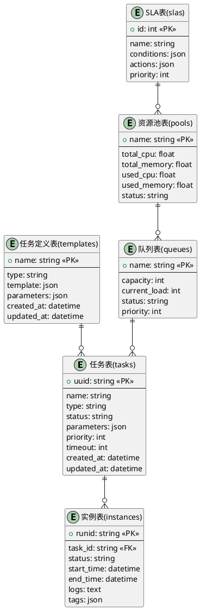

# 数据库设计文档

## 数据库架构图



## 表结构说明

### 1. 任务表(tasks)
存储任务的基本信息

| 字段名 | 类型 | 说明 |
|--------|------|------|
| uuid | string | 主键，任务唯一标识 |
| name | string | 任务名称 |
| template | string | 任务模板 |
| status | string | 任务状态 |
| parameters | json | 任务参数 |
| priority | int | 任务优先级 |
| timeout | int | 超时时间(秒) |
| created_at | datetime | 创建时间 |
| updated_at | datetime | 更新时间 |

### 2. 实例表(instances)
存储任务实例的执行信息

| 字段名 | 类型 | 说明 |
|--------|------|------|
| runid | string | 主键，实例唯一标识 |
| task_id | string | 外键，关联任务ID |
| status | string | 实例状态 |
| start_time | datetime | 开始时间 |
| end_time | datetime | 结束时间 |
| logs | text | 执行日志 |
| tags | json | 实例标签 |

### 3. 任务定义表(templates)
存储任务模板的定义信息

| 字段名 | 类型 | 说明 |
|--------|------|------|
| name | string | 主键，定义名称 |
| engine | string | 任务引擎 |
| schema | json | 任务模板的元数据 |
| parameters | json | 参数定义 |
| created_at | datetime | 创建时间 |
| updated_at | datetime | 更新时间 |

### 4. 队列表(queues)
存储任务队列信息

| 字段名 | 类型 | 说明 |
|--------|------|------|
| name | string | 主键，队列名称 |
| capacity | int | 队列容量 |
| current_load | int | 当前负载 |
| status | string | 队列状态 |
| priority | int | 队列优先级 |

### 5. 资源池表(pools)
存储资源池信息

| 字段名 | 类型 | 说明 |
|--------|------|------|
| name | string | 主键，资源池名称 |
| total_cpu | float | 总CPU资源 |
| total_memory | float | 总内存资源 |
| used_cpu | float | 已用CPU资源 |
| used_memory | float | 已用内存资源 |
| status | string | 资源池状态 |

### 6. SLA表(slas)
存储服务级别协议信息

| 字段名 | 类型 | 说明 |
|--------|------|------|
| id | int | 主键 |
| name | string | SLA名称 |
| conditions | json | 触发条件 |
| actions | json | 执行动作 |
| priority | int | 优先级 |

## 索引设计

### 1. 任务表索引
```sql
CREATE INDEX idx_tasks_status ON tasks(status);
CREATE INDEX idx_tasks_type ON tasks(type);
CREATE INDEX idx_tasks_created ON tasks(created_at);
```

### 2. 实例表索引
```sql
CREATE INDEX idx_instances_task ON instances(task_id);
CREATE INDEX idx_instances_status ON instances(status);
CREATE INDEX idx_instances_time ON instances(start_time);
```

### 3. 队列表索引
```sql
CREATE INDEX idx_queues_status ON queues(status);
CREATE INDEX idx_queues_priority ON queues(priority);
```

## 数据库维护

### 1. 备份策略
- 每日全量备份
- 每小时增量备份
- 保留最近30天的备份

### 2. 性能优化
- 定期清理历史数据
- 监控慢查询
- 优化索引使用

### 3. 高可用设计
- 主从复制
- 读写分离
- 故障自动切换

## 数据迁移

### 1. 版本升级
```sql
-- 示例：添加新字段
ALTER TABLE tasks ADD COLUMN new_field VARCHAR(255);
```

### 2. 数据清理
```sql
-- 示例：清理过期数据
DELETE FROM instances WHERE end_time < DATE_SUB(NOW(), INTERVAL 30 DAY);
```

## 注意事项
1. 所有表都需要记录创建和更新时间
2. 重要操作需要记录操作日志
3. 定期进行数据备份
4. 监控数据库性能
5. 遵循数据库命名规范 