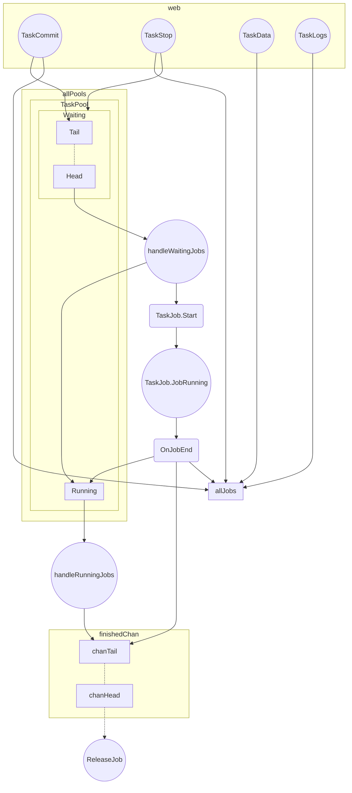

```mermaid

graph TD
    handleWaitingJobs((handleWaitingJobs))
    handleRunningJobs((handleRunningJobs))
    JobRunning((TaskJob.JobRunning))
    ReleaseJob((ReleaseJob))
    TaskJobStart(TaskJob.Start)
    OnJobEnd(OnJobEnd)

    subgraph web
        TaskCommit((TaskCommit))
        TaskStop((TaskStop))
        TaskData((TaskData))
        TaskLogs((TaskLogs))
    end

    subgraph allJobs
    end

    subgraph allPools
        subgraph TaskPool
            subgraph Waiting
                Tail
                Head
                Tail -.- Head
            end
            subgraph Running
            end
        end
    end
    subgraph finishedChan
        chanHead
        chanTail
        chanTail -.- chanHead
    end

    TaskCommit --> Tail
    TaskStop --> Waiting
    Head --> handleWaitingJobs 
    handleWaitingJobs --> TaskJobStart
    handleWaitingJobs --> Running
    Running --> handleRunningJobs 
    TaskJobStart --> JobRunning
    JobRunning --> OnJobEnd
    OnJobEnd --> chanTail
    OnJobEnd --> Running
    OnJobEnd --> allJobs
    handleRunningJobs --> chanTail

    TaskCommit --> allJobs
    TaskData --> allJobs
    TaskLogs --> allJobs
    TaskStop --> allJobs
    chanHead -.-> ReleaseJob

```