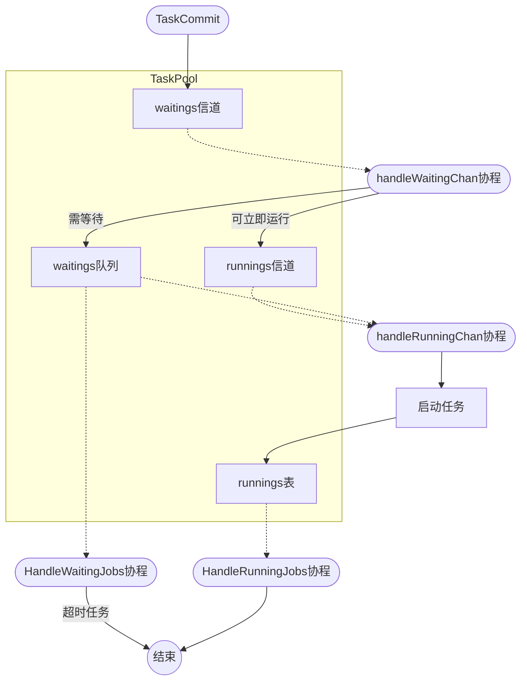

# 任务池设计

任务池TaskPool中，有两个数据结构用来控制任务的等待，与执行监控，分别是等待队列waitings，和执行表runnings。

等待队列waitings，是一个FIFO的任务列表，队列中存放的是等待执行的任务。

执行表runnings，是一个键值表，键为任务的UUID，值为任务的指针。

TaskCommit是controllers模块的任务提交函数，负责把任务推入waitings。
HandleWaitingJobs是一个协程，等待HandleRunningJobs的通知，从waiting获取等待任务，放入runnings。
HandleRunningJobs是一个协程，负责轮询runnings，当任务为完成状态时，从runnings表中删除。

使用协程实现一个队列执行函数，接收上游输入的任务，放入队尾，接收下游通知，从队头弹出任务，当有任务超时，则主动将任务踢出队列。

## 任务池流程图

